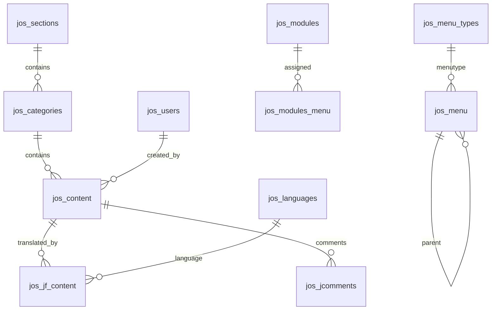

# Joomla schema analysis — khujand.tj

## Status of live dump

The file `information_schema.sql` in the repo root is **not** the site database. It is phpMyAdmin’s export of MySQL’s system catalog (`information_schema`) with empty view shells and **no** `INSERT` rows and **no** `jos_*` tables.

Until `dumps/khujand_joomla.sql` is provided, analysis below combines:

1. Typical **Joomla 1.0 / 1.5** (2005–2009) schema (prefix `jos_`)
2. Front-end evidence in this Next.js clone (YOO Flux, Joom!Fish, jComments, IceTabs, News Pro GK4, LOF scroller)
3. Content entities already extracted into `src/data/`

## Likely CMS version

| Signal | Inference |
|--------|-----------|
| Admin URL `option=com_login` | Classic Joomla administrator |
| Assets: `templates/yoo_flux`, `com_jcomments`, Joom!Fish paths | Joomla 1.5-era stack |
| Sections + categories in URLs (`catid=36`, `Itemid=…`) | Content model of 1.5 (`jos_sections` + `jos_categories` + `jos_content`) |
| `lang=tg\|ru\|en` query params | Joom!Fish (or similar) multilingual layer |

## Entity map (legacy → meaning)



### Core content

- **`jos_content`** — articles/news: `title`, `alias`, `introtext`, `fulltext`, `catid`, `sectionid`, `state`, `created`, `images`, `ordering`, `hits`
- **`jos_categories`** / **`jos_sections`** — tree used for news (`navgoni`), resolutions (`qarorho`), structures, etc.
- URLs on the live site still look like:  
  `index.php?option=com_content&view=article&id=9984&catid=36&Itemid=182&lang=tg`

### Navigation & modules

- **`jos_menu` / `jos_menu_types`** — main menu; `link` often points at `com_content` Itemids
- **`jos_modules` / `jos_modules_menu`** — IceTabs slider, News GK4, LOF scroller, YouTube, Gismeteo, mayor block (module `params` JSON/INI)

### Multilingual (Joom!Fish)

- **`jos_languages`** — `tg`, `ru`, `en` (iso/code)
- **`jos_jf_content`** — row-per-field translations: (`reference_table`, `reference_id`, `reference_field`, `language_id`, `value`)
  - Typical fields: `title`, `introtext`, `fulltext`, `alias` on `content`; `name` on `menu`

### Users & comments

- **`jos_users`** — admin accounts (`usertype` / `gid` for ACL in 1.5)
- **`jos_jcomments`** — article comments by `object_id` + `object_group`

### Media

- Files under `/images/stories/…` (mirrored in `public/images`), not a rich media DB table in classic Joomla

## Mapping to this Next.js clone (`src/data`)

| Site feature | Static source | Legacy source (expected) |
|--------------|---------------|--------------------------|
| Home slides | `i18n/home.ts` slides | `jos_modules` (IceTabs) + linked `jos_content` |
| News / archive | `home.ts` news + `boygoni` | `jos_content` in news category |
| Mayor / deputies / leaders | home LOF + `muovinon` / `rohbaron` | content + modules |
| Sector pages | `pages/soxtor.ts` | content categories |
| Economy | `pages/iqtisod.ts` | content |
| History / mahallas | `tarikh` / `aholi` | content or custom HTML |
| Menu | `i18n/menu.ts` | `jos_menu` + JF translations |
| Decisions list | `decisionDetails` | category of resolutions |
| UI chrome | `i18n/ui.ts` | language files / templates |

## What the new admin must cover (scope)

In scope for replacement:

1. Articles / pages (all types) with **tg / ru / en**
2. News (+ home slide flags)
3. Nested menu
4. Homepage module settings (YouTube, Gismeteo, mayor, footer)
5. Admin users (new auth — do not reuse old Joomla password hashes as-is)
6. Media paths (reuse `/public/images`)

Out of scope for v1:

- Full Joomla ACL / extensions marketplace
- Plugin/module PHP runtime
- jComments moderation (optional later)

## Next step when real dump arrives

```bash
node scripts/validate-joomla-dump.mjs dumps/khujand_joomla.sql
npm run db:migrate:joomla -- dumps/khujand_joomla.sql
```

The importer maps `jos_content` (+ `jos_jf_content`) into the new Prisma tables documented in `docs/new-schema.md`.
